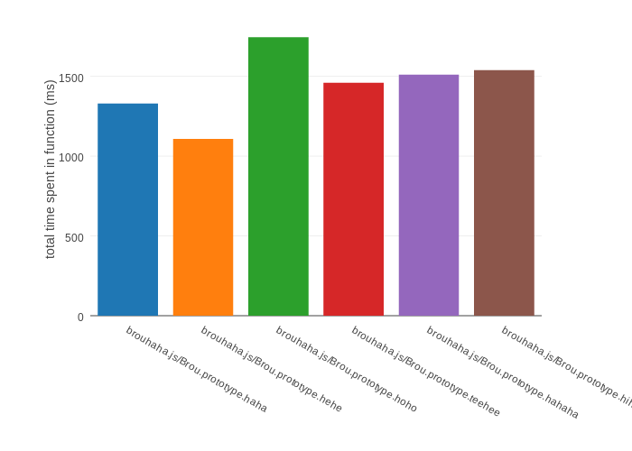

## A quick and easy way to send your module tracing information to Plotly.

###Usage
```javascript
var PlotlyFormatter = require('plotly-njstrace');

var traceOptions = { 
	formatter: new PlotlyFormatter('username', 'apiKye', 'graph name', 5000) 
};

// Call inject and use plotly formatter in opts
var njstrace = require('njstrace').inject(traceOptions);

var Brou = require('./examples/brouhaha.js');
var brou = new Brou();

// Do some stuff on "b"
setInterval(function run(){
    brou.haha(1000);
    brou.hehe(10000);
    brou.hoho(1000);
    brou.teehee(1000000);
    brou.hahaha(10000);
    brou.hihihi(1000);
}, 1000);
```

#### Outputs



